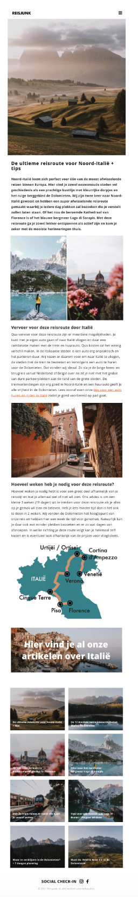

# Procesverslag
**Auteur:** -Nienke Cornielje-

Markdown cheat cheet: [Hulp bij het schrijven van Markdown](https://github.com/adam-p/markdown-here/wiki/Markdown-Cheatsheet). Nb. de standaardstructuur en de spartaanse opmaak zijn helemaal prima. Het gaat om de inhoud van je procesverslag. Besteedt de tijd voor pracht en praal aan je website.

## Bronnenlijst
1. https://www.youtube.com/watch?v=OjQP7rPwJyE
2. -bron 2-
3. -...-

## Eindgesprek (week 7/8)

-dit ging goed & dit was lastig-

Meeting gehad, ik ben nog niet klaar want helemaal geen tijd gehad om eraan te werken helaas. Gelukkig feedback erop gehad. Er is nog wat weinig verschillende
soorten content. Dan maak je het voor jezelf lastiger om een voldoende te halen dus het is goed om een video, een contactformulier toe te voegen.Zelf zat ik ook te denken aan een leuke animatie die een keer door het scherm door komt. Ook is het belangrijk om aan de finisch and touch te denken, poets de site even op en maak het een mooi geheel. dus het komt wel goed. even doorpakken maar gelukkig heb ik nu wat meer tijd ervoor.
Opsich ben ik niet heel slecht bezig,de basis staat maar er moeten wat inhaalslagen gemaakt worden.

**Screenshot(s):**

-screenshot(s) van je eindresultaat-

## Voortgang 3 (week 6)

-same as voortgang 1-
er was een probleem met de tekst op het midden van de afbeelding krijgen. dit deed ik met justify content-center en nog zo eentje maar het werkte niet omdat ik de moeeder van display flex op de verkeerder moeder had gezet. gelukig kwamen ze er in dit gesprek achter en hebben we dat kunnen fiksen. wel ga ik nog even die les een keertje doornemen zodat ik dit niet nog een keer ga hebben.

## Voortgang 2 (week 5)

-same as voortgang 1-

feedback gehad op de symantiek van mijn code. ik heb nu classes en id's gebruikt wat niet de bedoeling is want we moeten nth-dingen gebruiken. daarnaast kan ik de root-var vaker gebruiken dan dat ik nu doen en h1, h2, h3 spreek ik nu los aan terwijl die allemaal hetzelfde font en kleur hebben dit kan ik in een keer aanspreken. daarnaast kan ik ook notities zetten in mijn css zodat ik het zelf en anderen makkelijker kunnen begrijpen dus dat ik ook een goede tip. ook even gekeken naar mijn javascript en ik heb die in mijn html gezet wat niet de bedoeling is dus dat moet ik even verplaatsen naar mijn javascript en css.

## Voortgang 1 (week 3)

### Stand van zaken

Hamburgermenu is gefixt

-dit ging goed & dit was lastig-

Lastig: header bleef niet fixed, dit hebben we opgelost door een x-index toe te passen wat heeft geholpen. ook hielp het mee om de main al te zetten op 100%vooral met de afbeeldingen, op die manier wat het ook makkelijker om te zien waarom het niet fixed bleef staan.
javascript pakt het nog niet, hier kan ik even naar kijken door de error code die tevoorschijn komt in de browser inspecteren.

**Screenshot(s):**

-screenshot(s) van hoe ver je bent met korte uitleg-

### Verslag van meeting

-na afloop snel uitkomsten vastleggen-

## Breakdownschets (week 1)

-uitwerken voor de 1e werkgroep - eind van de eerste week-

Intake (week 1)

**Je startniveau:** blauw

**Je focus:** surface plane

**Je opdracht:** https://www.reisjunk.nl/

**Screenshot(s) van de eerste pagina (small screen):**

**Screenshot(s) van de tweede pagina (small screen):**

